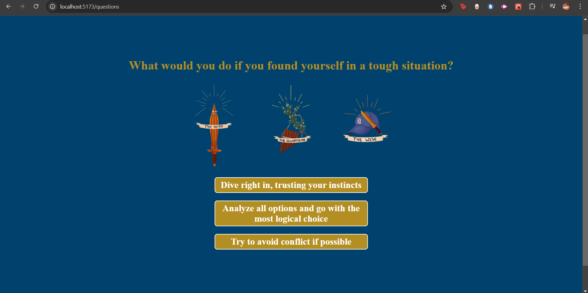

# character-quiz-react

## Description

I built this project to get back into the basics of react, and refamiliarise myself with the foundational concepts.

## Challenges

- i have one challenge that i am yet to figure out but when i click an option for the final question, which then takes me to the result page i get this error in the console:
    hook.js:608 Warning: Cannot update a component (`BrowserRouter`) while rendering a different component (`Questions`). To locate the bad setState() call inside `Questions`, follow the stack trace as described in https://reactjs.org/link/setstate-in-render Error Component Stack
        at Questions (Questions.jsx:7:20)
 it is not effecting the functionality but i will try to figure it out soon.

## Application
https://shukri-react-quiz.netlify.app

